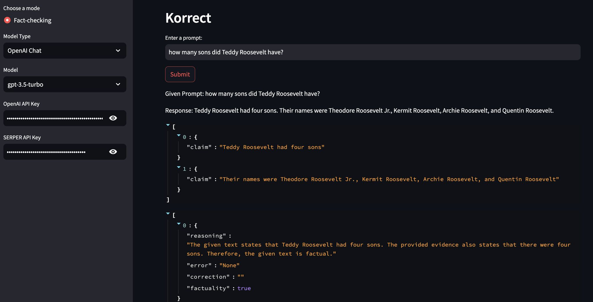

## Korrect

```python
from korrect import Korrect

k = Korrect()
```

then navigate to `http://localhost:8501/` and you'll find the UI:



right now, korrect only supports openai models.

### Development 

For development, please run:

```python
python3 -m venv myenv
source myenv/bin/activate
pip3 install -e .
```

### Roadmap

- [ ] fix import error ModuleNotFound
- [ ] add Huggingface model support
- [ ] fix async await calls
- [ ] dockerize
- [ ] env config
- [x] fix yaml file directory error

### Contributions

To contribute, please see our [contribution guide.](./CONTRIBUTING.md)

Join our discord community [here](https://discord.gg/stGaVVhq) 